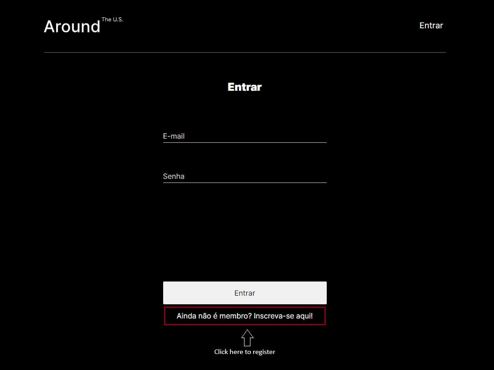
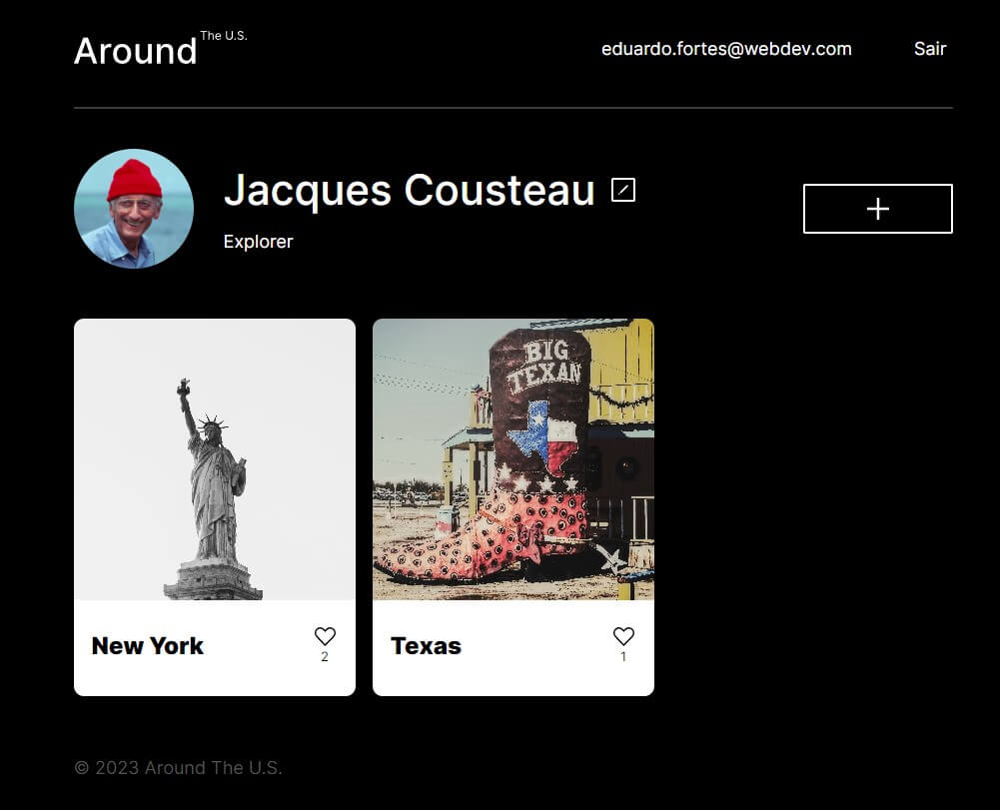
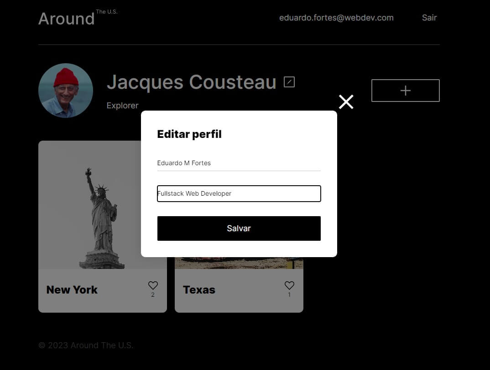
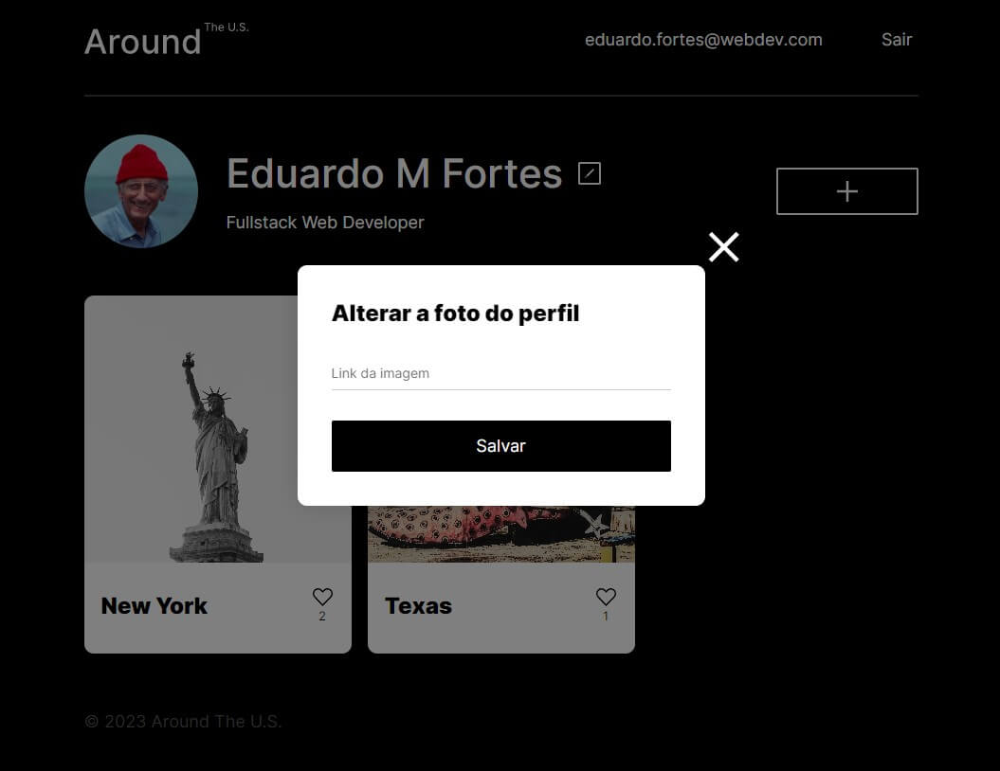
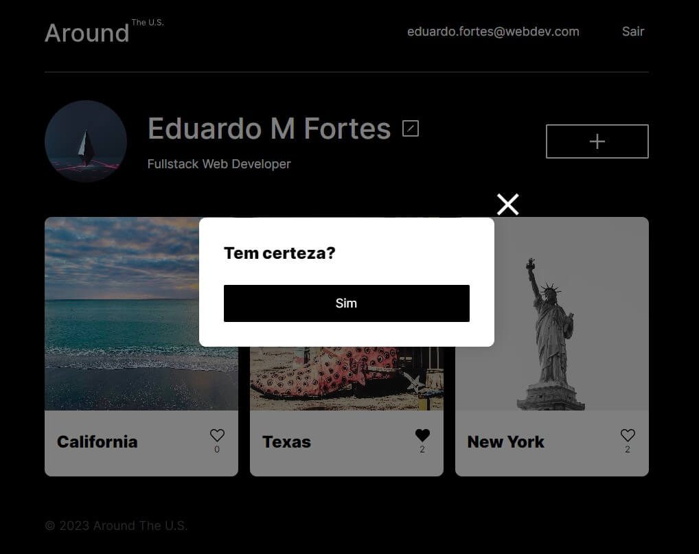
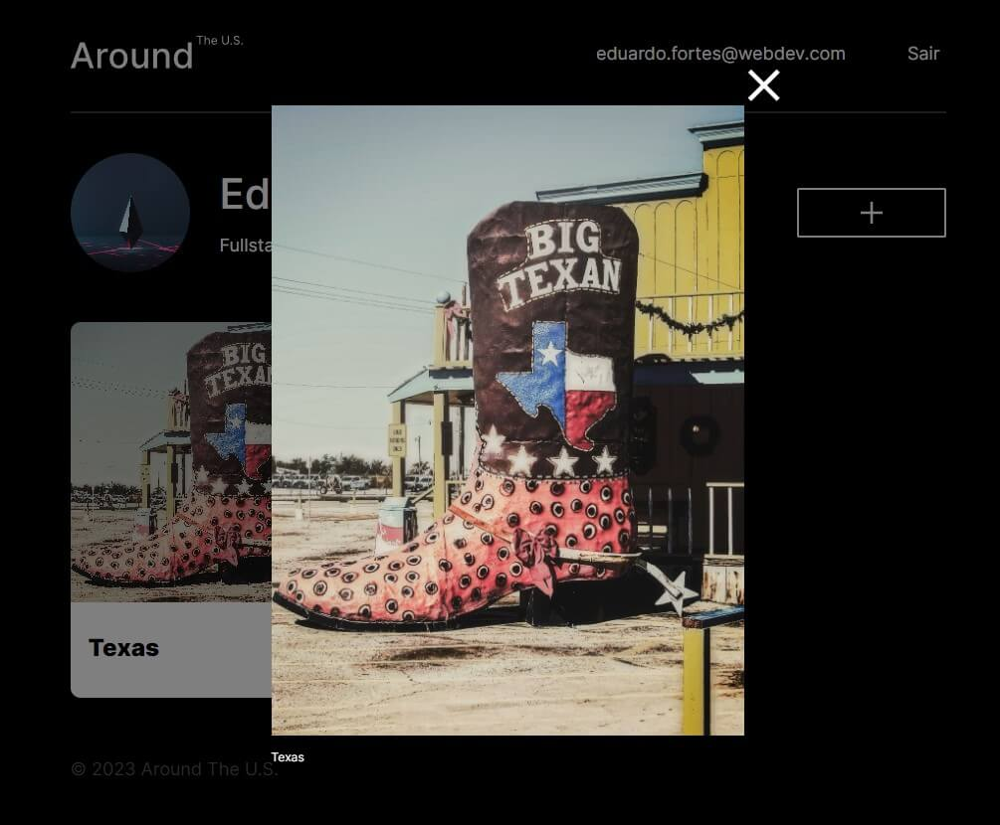
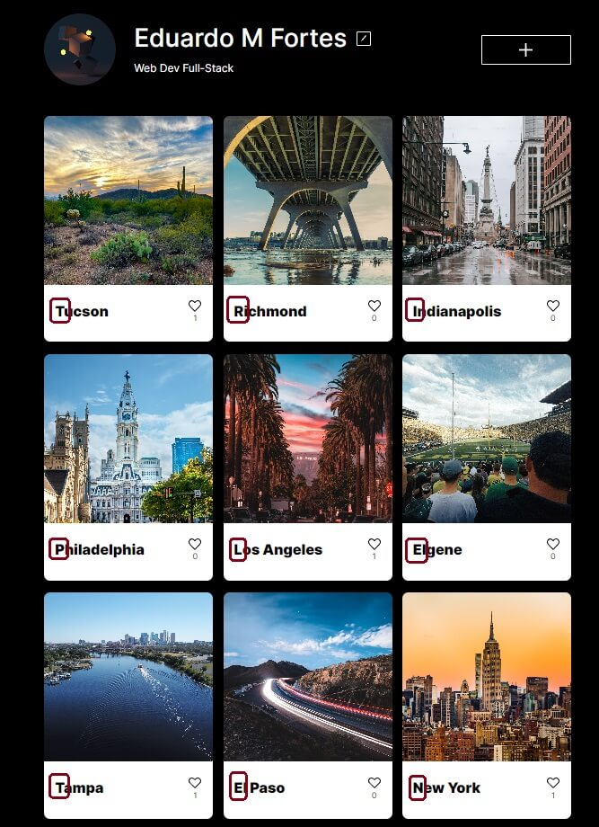

<!-- BACKEND README -->

<!-- PROJECT LOGO -->
<br />
<div align="center" >
  <a href="https://github.com/github_username/repo_name">
    
  </a>

<h3 align="center">FULL-STACK</h3>

  <p align="center">
    TripleTen WebDev bootcamp project
  </p>
</div>

<!-- TABLE OF CONTENTS -->
<details>
  <summary>Table of Contents</summary>
  <ol>
    <li>
      <a href="#about-the-project">About The Project</a>
      <ul>
        <li><a href="#built-with">Built With</a></li>
      </ul>
    </li>
    <li>
      <a href="#getting-started">Getting Started</a>
    </li>
    <li><a href="#usage">Usage</a>
    <ul>
      <li><a href="#change-user-name-and-about-information">Change user name and about information</li>
      <li><a href="#change-avatar-picture">Change avatar picture</li>
      <li><a href="#add-new-card">Add new card</li>
      <li><a href="#deleting-a-card">Deleting a card</li>
      <li><a href="#increasing-card-image">Increasing card image</li>
      <li><a href="#like-a-card">Like a card</li>
    </ul>
    </li>
    <li><a href="#contributing">Contributing</a></li>
    <li><a href="#easter-egg">Easter Egg</a></li>
  </ol>
</details>

<!-- ABOUT THE PROJECT -->

## About The Project

This "The Around U.S" WebApp is the final project of TripleTen Web Development bootcamp.

In this App you can register, login and post photos of U.S.A places that you visited. You can like and dislike a photo of your our other user. If you do not like the photo that you post earlier you can delete it clicking in the trash button on the top right corner of the photo. After you made the registration and login to the page, change your user name and your about field and you can change your avatar picture too.

In this project I had the oportunity to develop my fullstack knowledge learned throughout the course. I have to say that was amazing.

I did not know anything about web development and ending with this project is something very special.

I hope you like it as much a liked to code it.

You can check the project at [https://aroundfull.abacusstar.com.au](https://aroundfull.abacusstar.com.au)

### Built With

### Backend

- [![NodeJS][NodeJS]][NodeJS-url]
- [![MongoDB][MongoDB]][MongoDB-url]
- [![Express][Express.js]][Express-url]
- [![Mongoose][Mongoose]][Mongoose-url]
- [![Postman][Postman]][Postman-url]

### Frontend

- [![React][React]][React-url]
- [![ReactRouter][ReactRouter]][ReactRouter-url]

<!-- GETTING STARTED -->

## Getting Started

As soon you access the page, it will ask for your credentials, but you do not have it yet, so click on "Ainda não é membro? Inscreva-se aqui" link, below the "Entrar" button.



You will receive a popup message if your registration was successful. After that, enter your registered e-mail and password to go to the user home page.



## Usage

### Change user name and about information

To change the user name and about information just click on the edit icon (pencil). Delete the default name and about and put yours. Hit the "Salvar" button. You should see the new entered data on the page.



### Change avatar picture

To change the avatar picture follow the same step when changing the user profile information. Hover over the avatar picture and click on the edit icon (pencil). In this field put your image URL.



### Add new card

Click on the button with a "plus sign", fill in the requered fields - name and image URL, hit "Criar"button.

You will see the new card added to the top of the stack.


### Deleting a card

To delete a card just click on the trash button on the top right corner of the card and confirm the deletion when prompted.

You can only delete the cards you posted.



### Increasing card image

To see clearly the card picture you can click on it to enlarge the photo. This way you can see the details and give a step further liking waht you see.



### Like a card

If you liked your card or the card of other user, you can show it by clicking in the heart icon.

Below the heart icon are the number of likes that card received.

And if you do not like the card anymore, just hit the heart again and it will be disliked.

<!-- CONTRIBUTING -->

## Contributing

Contributions are what make the open source community such an amazing place to learn, inspire, and create. Any contributions you make are **greatly appreciated**.

If you have a suggestion that would make this better, please fork the repo and create a pull request. You can also simply open an issue with the tag "enhancement".
Don't forget to give the project a star! Thanks again!

1. Fork the Project

2. Create your Feature Branch

```sh
git checkout -b feature/AmazingFeature
```

3. Commit your Changes

```sh
git commit -m 'Add some AmazingFeature'
```

4. Push to the Branch

```sh
git push origin feature/AmazingFeature
```

5. Open a Pull Request

<p align="right">(<a href="#readme-top">back to top</a>)</p>

## Easter Egg

Can you guess what word form using the first letter of each card?



I will give you a tip: It gives you the best bootcamp for web development. LOL

<!-- MARKDOWN LINKS & IMAGES -->
<!-- https://www.markdownguide.org/basic-syntax/#reference-style-links -->

[NodeJS]: https://img.shields.io/badge/node.js-6DA55F?style=for-the-badge&logo=node.js&logoColor=white
[NodeJS-url]: https://nodejs.org/en
[MongoDB]: https://img.shields.io/badge/MongoDB-%234ea94b.svg?style=for-the-badge&logo=mongodb&logoColor=white
[MongoDB-url]: https://www.mongodb.com/
[Express.js]: https://img.shields.io/badge/express.js-%23404d59.svg?style=for-the-badge&logo=express&logoColor=%2361DAFB
[Express-url]: https://expressjs.com/
[Mongoose]: https://img.shields.io/badge/Mongoose-880000.svg?style=for-the-badge&logo=Mongoose&logoColor=white
[Mongoose-url]: https://mongoosejs.com/
[Postman]: https://img.shields.io/badge/Postman-FF6C37.svg?style=for-the-badge&logo=Postman&logoColor=white
[Postman-url]: https://www.postman.com/
[React]: https://img.shields.io/badge/-ReactJs-61DAFB?logo=react&logoColor=white&style=for-the-badge
[React-url]: https://react.dev/
[ReactRouter]: https://img.shields.io/badge/-React%20Router-CA4245?logo=react-router
[ReactRouter-url]: https://reactrouter.com/en/main
